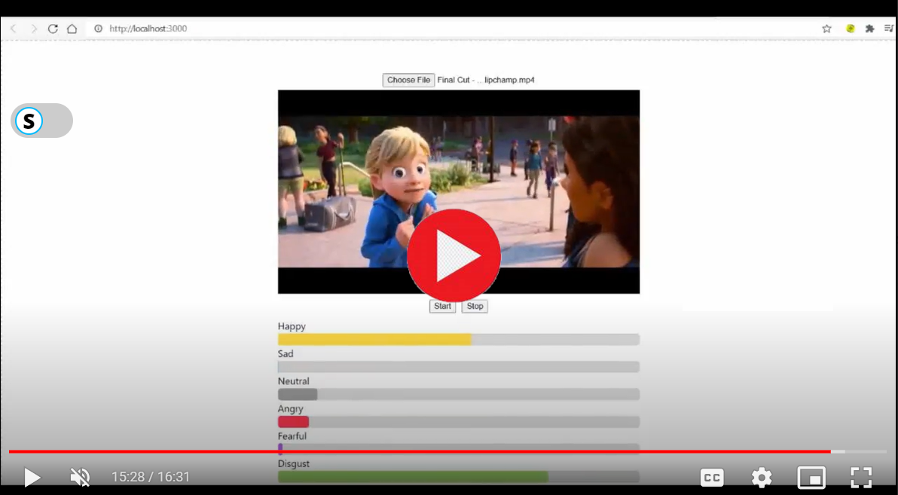
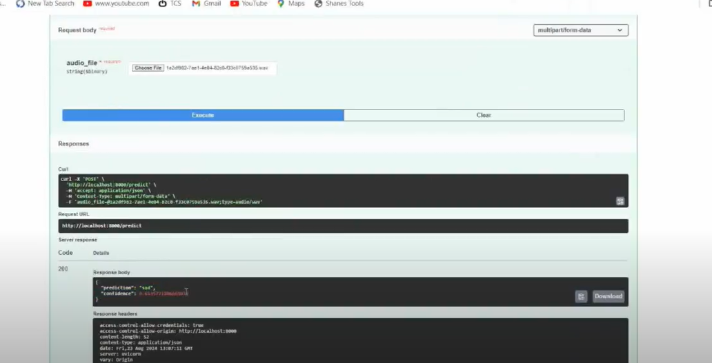
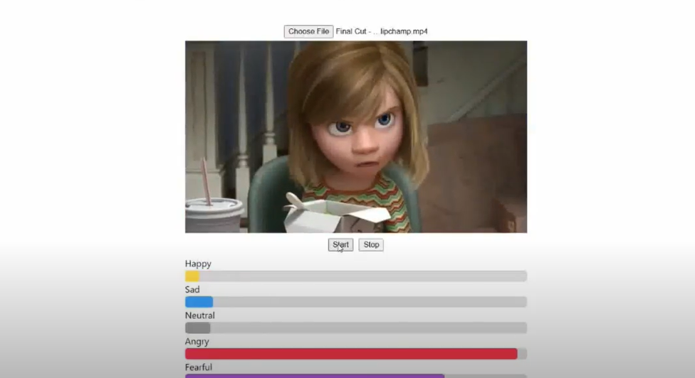

# SPEECH-EMOTION-RECOGNITION

## 🎙️ About the Project
**Speech Emotion Recognition** 
This project involves developing a system that processes video inputs to detect emotions based on audio content. By utilizing Convolutional Neural Networks (CNNs), the system analyzes audio tracks extracted from videos to classify and interpret various emotional states. The CNN model is trained to recognize distinct audio features associated with different emotions, enabling accurate detection of emotions such as happiness, sad, anger, fear,  surprise and nutral

## 🎥 Watch Video
[](https://drive.google.com/file/d/1jlgvv4vs7lF1YOLK26_vvy15Zr51M_y1/view?usp=drive_link)

## ✨ Features

- **Emotion Detection:** predicts emotions like happiness, sadness, anger, sad , disgust ,fear and nutral.
- **Real-time Analysis:** Processes live audio for immediate emotion recognition.

## 🛠️ Installation

To set up and run the **Speech Emotion Recognition** system, follow these steps:

1. **Clone the repository:**
    ```bash
    git clone https://github.com/yourusername/Speech-Emotion-Recognition.git
    cd Speech-Emotion-Recognition
    ```

2. **Install dependencies:**
    ```bash
    pip install -r requirements.txt
    ```

3. **Set up your environment variables:**
   - Create a `.env` file in the root directory.
   - Add any necessary API keys or configuration settings:
     ```env
     API_KEY=your-api-key
     ```

4. **Run the system:**
    ```bash
    python main.py
    ```

5. **Start the Frontend:**
    - Navigate to the `frontend` directory and start the React application:
    ```bash
    cd frontend
    npm install
    npm start
    ```

## 🚀 Usage

Once the system is running, you can interact with it through the web interface or API calls. Here are some examples:

### Real-time Emotion Detection

- **Upload an Audio Clip:**
  - Endpoint: `POST /localhost:8000/upload`
  - Description: Upload an audio file to be analyzed for emotion detection.
  

- **View Detected Emotions:**
  - Endpoint: `GET http://localhost:8000/predict`
  - Description: Retrieve the emotions detected from the uploaded audio clip.
  

- **Live Audio Input:**
  - Description: Use the microphone icon on the web interface to start live analysis of audio input.
  

